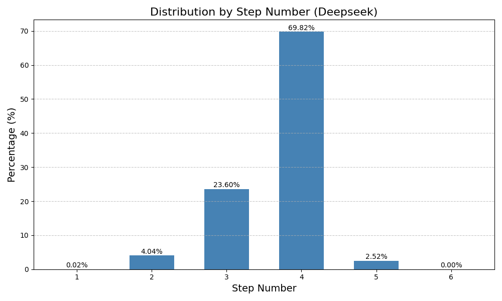
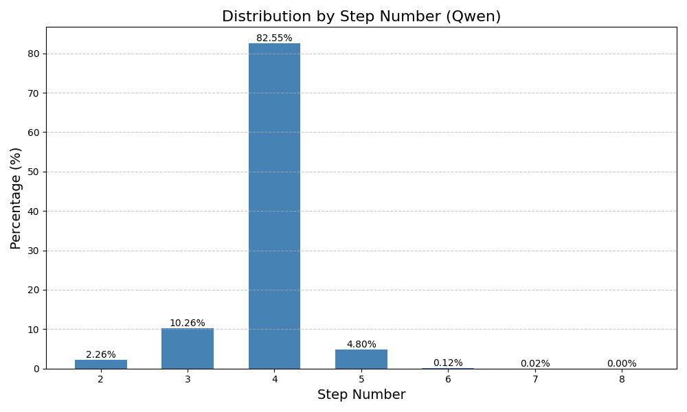
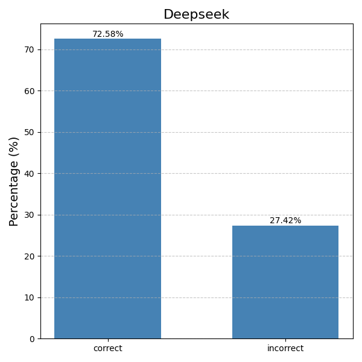
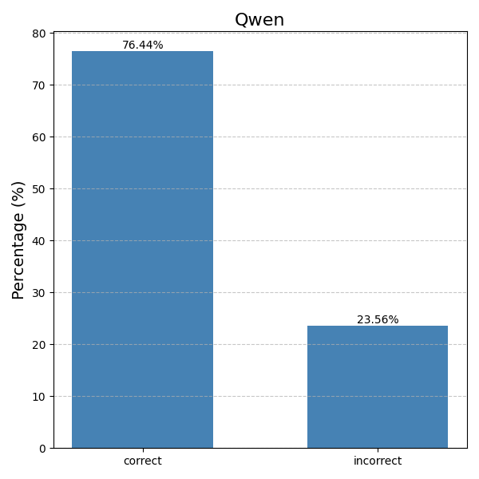

# SEER

This repository contains the implementation of our ICSE'26 submission: "SEER: Enhancing Chain-of-Thought Code Generation through Self-Exploring Deep Reasoning".

## Repository Structure
```
├── data/ 
├── data_collection/ # Data collection tools and scripts
│ ├── correction.py
│ ...
│ └── README.md 
├── model_training/ # SPEAR model training code
│ ├── output/ 
│ └── src/
│ └── README.md 
├── open-r1/ # DeepSeek-R1 reproduction implementation
│ ├── recipes/
│ ├── src/
│ └── README.md 
├── Template.md # Prompt templates used in experiments
├── Result.md # Detailed experimental results
├── requirements.txt #
└── README.md
```

## Installation

Install all required dependencies with:

```sh
pip install -r requirements.txt
```

## Usage

1. **Data Collection**: Follow the instructions in `./data_collection/README.md` to build the dataset.
2. **Model Training**: Refer to `./model_training/README.md` for training the SPEAR model.

## Resources

### Data and Models
- The seed data is located in the `./data` directory
- We have uploaded the data collected through MCTS [here](https://zenodo.org/records/15039403)
- Trained models are available on [Zenodo](https://zenodo.org/records/15042929) (we plan to add them to Huggingface after the anonymous submission period)


During MCTS data collection, we analyzed path quality across different models. For DeepSeek-Coder-6.7B-Instruct, 29.5% of samples contained exclusively correct paths, while 11.8% contained only incorrect paths. Similarly, for Qwen2.5-Coder-6.7B-Instruct, 29.4% of samples contained only correct paths, and 13.0% contained only incorrect paths. The following figures present comprehensive statistics of all paths in the MCTS trees, including their step distribution and correct/incorrect classification.
<table>
  <tr>
    <td></td>
    <td></td>
  </tr>
</table>
<table>
  <tr>
    <td></td>
    <td></td>
  </tr>
</table>


### Documentation
- `Template.md`: Contains the prompts used in our experiments
- `parameter.md`: Provides detailed parameter analysis experimental results and additional findings
- `results.md`: Contains the results of each run for main results and ablation study
- `path_perturbation.md`: Provides an example to detail the path perturbation process
