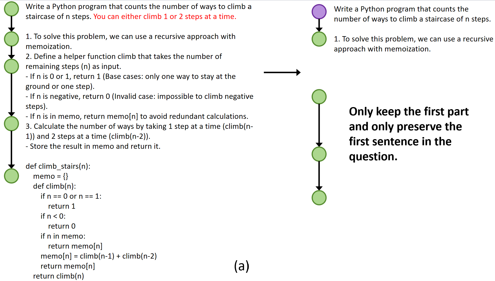
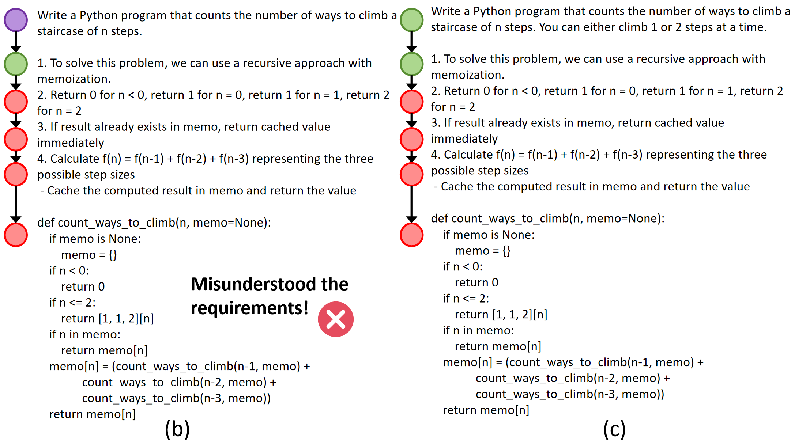

The path perturbation component aims to enhance training data diversity by generating additional negative examples for value model training. This approach improves the model's quality assessment ability for basic programming problems where MCTS fails to identify incorrect reasoning paths. Specifically, for samples containing only correct reasoning paths, we introduce path perturbation to generate corresponding incorrect paths.As illustrated in Figure 1(a), we randomly partition the original correct reasoning path into two segments: ${\mathbf{s}_0, \mathbf{a}_1, ... \mathbf{a}s}$ and ${\mathbf{a}{s+1}, ... \mathbf{a}_t}$. Next, we retain only the first segment while perturbing the problem description at the root node by preserving just the initial sentence. As shown in Figure 1(b), given this ambiguous requirement and the partial reasoning steps, LLMs generate subsequent steps and code that does not fit the original requirement. Finally, as depicted in Figure 1(c), after verifying through test cases that the generated code is incorrect, we replace the ambiguous requirement with the original specification to create an incorrect reasoning path. This process simulates scenarios where the model hallucinates or misinterprets requirements—a common occurrence in LLM-generated code [1].

[1] Zhang Z, et al. LLM Hallucinations in Practical Code Generation: Phenomena, Mechanism, and Mitigation. ISSTA 2025
